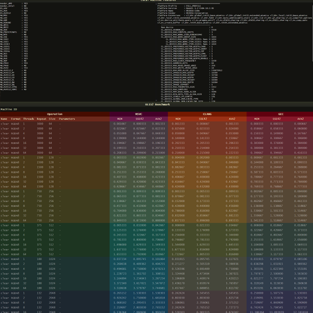

<p align="center">
    
</p>

## Overview
ULIS is a graphics library written in C++. It is aimed at software rendering and digital image processing on CPU.  

## Links
Official repository is hosted here https://github.com/Praxinos/ULIS3  
Official documentation can be found here https://praxinos.coop/ULIS/documentation/  
ULIS is developped and maintained by Clément Berthaud ( a.k.a Layl or Robot-Fromage ) http://clementberthaud.com/  
ULIS is primarily developped for Praxinos, a software company developping tools for artists. https://praxinos.coop/  

## Samples
 |  | 
---- | ---- | ----
 |  | 

## License
Check LICENSE.md, ULIS3 is not available for commercial use.
|Name               |Link                                                           |License            |
|-------------------|---------------------------------------------------------------|-------------------|
|ULIS3              |https://github.com/Praxinos/ULIS3                              |CC-BY-NC-ND-4.0    |

## Details

        Cross-Platform C++14 Library
        2D Software Rasterizer on CPU
        Build as static or dynamic library
        Very lightweight, good performance
        Generic Digital Image Processing
        Various bindings to other languages
        Read Write from files for many popular formats
        Convert beetween image formats
        Render Text to any image in memory
        Affine Image Transforms and other advanced deformation algorithms ( perspective, bezier )
        FX, Convolution, Blur, Noise, ...
        All Standard Pixel Blending Modes, and more
        Many Image Formats, Layouts and Types ( u8, u16, u32, float, double )
        Color Models ( RGB, HSL, HSV, CMY, CMYK, Lab, XYZ, ... )
        Color-Managed Pipelines, Color Profiles Support
        Multithreaded optimisations
        SSE4.2 and AVX2 optimisations
        Memory Efficient structures for large images ( 300k² ) or long sequences of images.
        Interoperability with GPUs via OpenCL
        Easy and fast interoperability with many libraries and 3D rendering APIs.

## Software Requirements

        Linux, Windows or MacOS
        CMake
        Git
        C++ compiler with support for C++14 or greater

## Dependencies
Dependencies are redistributed directly within the repository under the 3rdparty directory.

|Dependency         |Link                                                           |License            |
|-------------------|---------------------------------------------------------------|-------------------|
|clip               |https://github.com/dacap/clip                                  |MIT                |
|cppfs              |https://github.com/cginternals/cppfs                           |MIT                |
|eigen              |https://gitlab.com/libeigen/eigen                              |MPL2               |
|FeatureDetector    |https://github.com/Mysticial/FeatureDetector                   |CC0 1.0 Universal  |
|freetype2          |https://github.com/aseprite/freetype2                          |FTL ( BSD-like )   |
|glm                |https://github.com/g-truc/glm                                  |MIT                |
|Little-CMS         |https://github.com/mm2/Little-CMS                              |MIT                |
|OCL-SDK            |https://github.com/GPUOpen-LibrariesAndSDKs/OCL-SDK/releases   |-                  |
|static_math        |https://github.com/Morwenn/static_math                         |MIT                |
|stb_image          |https://github.com/nothings/stb                                |MIT                |
|stb_image_write    |https://github.com/nothings/stb                                |MIT                |
|VCL                |https://github.com/vectorclass/version1                        |Apache 2.0         |

Additional Optional library can be used with ULIS3 to test samples programs or build the python binding:

        Qt5.x
        Python3.x

## Bindings
ULIS3 officialy maintains a few bindings of the library. They are listed under the bindings/ directory. These bindings often have different build process than the library. Refer to the readme sections of the bindings for more details.
|Target             |Name               |
|-------------------|-------------------|
|Python             |PyULIS3            |
|Javascript ( wasm )|wULIS3             |

## ULIS3 for UnrealEngine ThirdParty Module
A `ULIS3.Build.cs` script is provided within the repository, in order to include ULIS3 as a third party library easily in an UnrealEngine project or plugin.  

## Getting Started

        git clone https://github.com/Praxinos/ULIS3
        mkdir ULIS3_Build
        cd ULIS3_Build
        cmake -G "Generator" ../ULIS3

Sample scripts are also available in the repository to help with the build process.

## Examples
This is a small sample illustrating image loading, copy and blend operations. Check samples to get a gist of how to use ULIS3, more details and specific functions.

```cpp
#include <ULIS3>
using namespace ::ul3;

int main() {
    FThreadPool  threadPool;
    uint32 perfIntent = ULIS3_PERF_MT | ULIS3_PERF_TSPEC | ULIS3_PERF_SSE42 | ULIS3_PERF_AVX2;
    FHostDeviceInfo host = FHostDeviceInfo::Detect();
    std::string pathBase = "base_160.png";
    std::string pathOver = "over_160.png";
    FBlock* blockBase = XLoadFromFile( &threadPool, ULIS3_NONBLOCKING, perfIntent, host, ULIS3_NOCB, pathBase, ULIS3_FORMAT_RGBA8 );
    FBlock* blockOver = XLoadFromFile( &threadPool, ULIS3_NONBLOCKING, perfIntent, host, ULIS3_NOCB, pathOver, ULIS3_FORMAT_RGBA8 );
    Fence( threadPool );
    FRect sourceRect = blockBase->Rect();
    int w = sourceRect.w * 8;
    int h = sourceRect.h * 5;
    FBlock* blockCanvas = new  FBlock( w, h, ULIS3_FORMAT_RGBA8 );
    for( int i = 0; i < NUM_BLENDING_MODES; ++i ) {
        int x = ( i % 8 ) * sourceRect.w;
        int y = ( i / 8 ) * sourceRect.h;
        Copy(   &threadPool, ULIS3_BLOCKING, perfIntent, host, ULIS3_NOCB, blockBase, blockCanvas, sourceRect, FVec2I( x, y ) );
        Blend(  &threadPool, ULIS3_NONBLOCKING, perfIntent, host, ULIS3_NOCB, blockOver, blockCanvas, sourceRect, FVec2F( x, y ), ULIS3_NOAA, static_cast< eBlendingMode >( i ), AM_NORMAL, 0.5f );
    }
    Fence( threadPool );
    delete  blockBase;
    delete  blockOver;
    delete  blockCanvas;
    return  0;
}
```

## Documentation
You can build ULIS3 documentation if you have doxygen installed on you computer. On Windows, simply run the build_documentation.bat script in the documentation folder.  
Alternatively, the built documentation is provided here too: https://praxinos.coop/ULIS/documentation/
